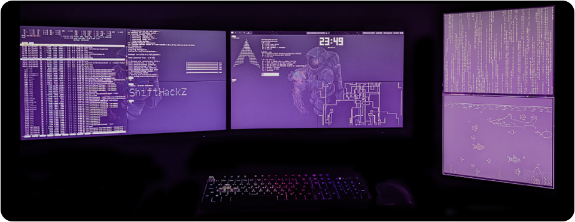

## 👨🏻‍💻 About me:

👋 Hi, I’m Dmitriy Moroz (aka [ShiftHackZ](https://github.com/ShiftHackZ)).

⭐️ An Open Source advocate.

🚀 Main technical stack: Moblile, Web.

🌱 Education: Ph.D. in Computer Science.

## 💬 How to contact me:

✉️ Email: <a href="mailto:dmitriy@moroz.cc">dmitriy@moroz.cc</a>

📄 For more information <a href="https://dmitriy.moroz.cc" target="_blank">check out my CV</a>.

## 🛠 Technical Stack:

#### 📋 Languages and tools:

#### 🗜 Software:

#### 💎 Infrastructure:

#### 💻 OS:

## 📊 Statistics:

<!---
ShiftHackZ/ShiftHackZ is a ✨ special ✨ repository because its `README.md` (this file) appears on your GitHub profile.
You can click the Preview link to take a look at your changes.
--->
